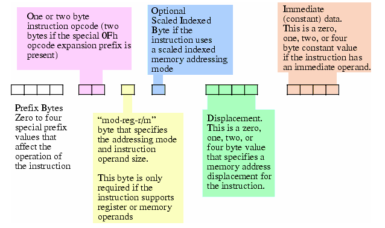

###Istruction Set CISC Complex Istruction Set Computer

La grandezza massima di un istruzione è di 16 byte, ma negli attuali x86 non sono permesse istruzioni più grandi di __15 byte__ 

[bianco] i primi 4 byte sono di prefisso (non sono quelli dell'opcode) servono a modificare il comportamento di una istruzione 

[viola] la grandezza dell opcode è di due opzioni, 1 byte (standard) o 2 byte il primo byte viene usato come prefisso __0Fh__ che sta per Opcode Expansion Prefix byte (512 differenti istruction classes):

La figura sopra mostro come vengono considerati i primi due bit.
l'opcode identifica una variante di un istruzione, ad esempio l'istruzione add ha 9 differenti tipi di unicode che dipendono dai parametri.

[giallo] Mod R/M identifica la modalità di indirizzamento e gli operandi (R/M = register and mode).
la sua struttura :

__MOD__ -> specifica la modalità di indirizzamento
__REG__ -> specifica il registro sorgente e destinazione 
__R/M__ -> assumono significato combinati se combinati con __MOD__ e vanno a determinare il displacement del registro oltre che al registro sorgente e destinazione, vedere link sotto per info.

(tabulazione dei valori del byte = http://www.c-jump.com/CIS77/CPU/x86/lecture.html#X77_0010_real_encoding  Sezione 6.)

[blu] usato per la modalità SIB, Scaled indexed adressing mode anche lui ha una sua struttura.

links:
http://www.c-jump.com/CIS77/reference/Instructions_by_Opcode.html - istruction by opcode